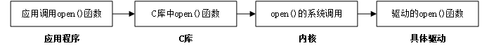

# Linux字符设备驱动开发

## 字符设备驱动

字符设备就是一个一个字节，按照字节流进行读写操作的设备，读写数据是分先后顺序的。

在Linux 中一切皆为文件，驱动加载成功以后会在`/dev`目录下生成一个相应的文件，应用程序通过对这个名为`/dev/xxx`的文件进行相应的操作即可实现对硬件的操作。

应用程序运行在用户空间，而Linux 驱动属于内核的一部分，因此驱动运行于内核空间。因此必须使用一个叫做**系统调用**的方法来实现从用户空间陷入到内核空间，这样才能实现对底层驱动的操作。在Linux 系统中，系统调用作为C库的一部分。

## 字符设备驱动开发步骤

### 驱动模块的加载和卸载

Linux驱动有两种运行方式，第一种就是将驱动编译进Linux内核中，这样当Linux内核启动的时候就会自动运行驱动程序。第二种就是将驱动编译成模块(.ko)，在Linux内核启动以后使用`insmod`命令加载驱动模块。

### 字符设备注册与注销

对于字符设备驱动而言，当驱动模块加载成功以后需要注册字符设备，同样，卸载驱动模块的时候也需要注销掉字符设备。

### 实现设备的具体操作函数

### 添加LICENSE和作者信息

LICENSE是必须添加的，否则的话编译的时候会报错，作者信息可以添加也可以不添加。

## Linux设备号