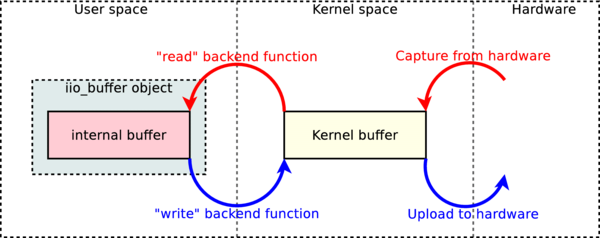
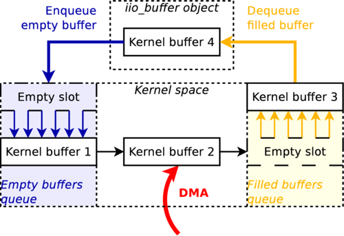
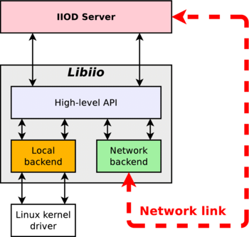
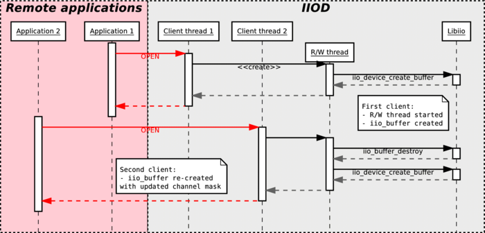
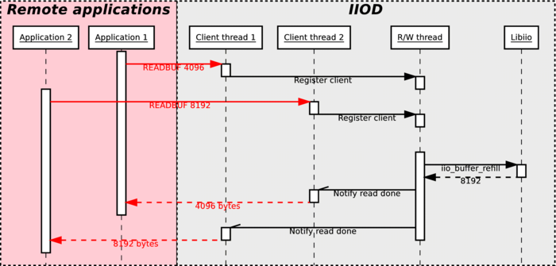
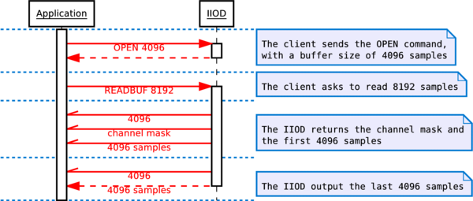
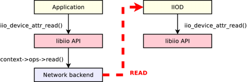
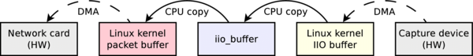
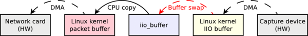
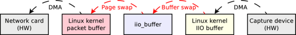

# 关于libiio

## 目的

Analog Devices 为什么要开发 libiio？要回答这个问题，需要了解libiio问世前的状况。

### 简化与标准化

Linux内核有一个IIO子系统，它为客户端应用程序提供了一个标准化的用户空间接口。为不同的IIO设备设计的各种驱动程序在IIO子系统上注册。因此，所有支持的设备都可以被用户空间的应用程序使用相同的接口。

至少，这是理论上的。现实情况更复杂；接口提供了不同的方法来读取或写入设备，每个驱动程序一般只实现最古老和最慢的方法。各种驱动程序也会在Linux的sysfs文件系统中创建略有不同的文件，所有用于配置接口的虚拟文件都在这里。

因此，在libiio诞生之前，使用IIO设备的应用程序一般会被设计成只支持一个特定的设备，因为同时支持几个设备的工作量太大。正因为如此，很多应用程序都有自己的代码来与内核的IIO子系统对接，导致了维护问题。此外，对于客户来说，创建使用其硬件的应用程序是非常困难的，因为他们必须不断地重写接口代码或从已有的应用程序中改编。

libiio背后的目标是通过让新的库成为程序和内核之间的中介，缓解使用IIO设备的应用程序的开发过程。

通过巧妙地识别设备、可用的输入或输出通道，libiio允许一个应用程序支持广泛的设备。例如，如果应用程序请求一个具有捕获通道的设备，而不指定其名称，那么它将与迄今为止所有具有至少一个捕获通道的IIO设备以及未来尚未发明的硬件兼容。

### 高级功能

除了解决问题，libiio还宣布了新的功能。计划中的主要改进是网络后端，这将扩大一系列的可能性：作为一个单一的用户运行应用程序，从不同的应用程序中读取一个IIO设备，当然还有在一个应用程序中使用来自网络中任何地方的设备。

该网络后端也开启了其他可能的改进问题：例如，从运行在不同操作系统（如Windows）的应用程序中使用IIO设备，在GNU Radio、MATLAB或Simulink等环境中使用这些设备。

## 代码一致性

libiio 的大部分内容完全符合 C99 和 POSIX 标准，在任何由 C99 编译器支持的符合 POSIX 标准的操作系统上都应该可以编译。唯一的例外是本地后端，它是Linux专用的，因此只能在Linux系统上编译。该库也可以在Visual Studio下编译，它不完全支持C99（在2014年），在合理的情况下，它更倾向于ANSI C89。由于与C99和POSIX的一致性是项目开始时的设计决定，将库移植到Windows特别容易，只需要很少的改变，这要感谢Windows中提供的最近的POSIX套接字兼容层。

## 代码可见性

虽然公共API声明并引用了`iio_context`、`iio_device`、`iio_channel`和`iio_buffer`对象，但它们的内容永远不会被客户端应用程序知道。所有的公共函数都使用指向不透明结构的指针：

```c
struct iio_context;
__api void iio_context_destroy(struct iio_context *context);
```

在这个例子中，`iio_context`结构的内容从未被列出，但`iio_context_destroy`函数接受了一个指向该结构实例的指针作为参数。这种设计选择有几个好处：

- 客户端应用程序不能直接修改对象的内容；他们必须使用API的公共函数来代替。这就防止了应用程序搞乱库的内部结构。
- 由于客户端应用程序只操作指针，对象的结构可以从一个版本的库改变到另一个版本，而不会破坏ABI（二进制接口）。因此，一个用旧版本库编译的旧程序在新版本库中可以正常运行，即使所有对象的结构在新版本中发生了变化。这带来了很大的灵活性，因为客户端软件并不被一个特定版本的API所约束。

除此之外，构成 libiio API 的函数都以`__api`为前缀。这个符号标志着相应的函数在库中是可见的。没有被标记的函数被认为是隐藏的，不能从库外调用。这确保了客户端应用程序不能调用内部函数，而要使用 API 函数。

## 后端

libiio库从一开始就被设计为支持多个后端。目前的0.1版本有三个不同的后端：一个XML后端，一个本地后端，一个网络后端。具体来说，一个后端被一个`iio_context`对象所同化。对于每个后端，公共API中的一个函数允许创建相应的`iio_context`对象：

```c
__api struct iio_context * iio_create_local_context(void);
__api struct iio_context * iio_create_xml_context(const char *xml_file);
__api struct iio_context * iio_create_xml_context_mem(const char *xml, size_t len);
__api struct iio_context * iio_create_network_context(const char *host);
```

`iio_context`对象包含一个指向`iio_backend_ops`结构的指针：

```c
struct iio_backend_ops {
    ssize_t (*read)(const struct iio_device *dev, void *dst, size_t len, uint32_t *mask, size_t words);
    ssize_t (*write)(const struct iio_device *dev, const void *src, size_t len);
    ...
};
```

这个结构包含了一组对应于低级功能的函数指针：读取一个属性、打开一个设备、流式数据......这些函数是特定于所使用的后端。例如，`read`功能指针在XML后端中是空的（因为它不支持流数据），在本地后端中指向一个从Linux内核中检索充满新捕获样本的缓冲区的功能，或者在网络后端中指向一个通过网络发送读取请求的功能。

有一点需要考虑的是，并不要求所有的后端都能工作。例如，Windows版本在编译时没有本地后端，因为这个后端是Linux专用的；在编译库时，可以不使用网络和XML后端，而是在开发板上运行IIO设备，因为这些都是未使用的。

## 分层

libiio库是由两个不同的层构建的。顶层包含所有公共函数的实现，这些函数可以独立于用来创建`iio_context`对象的后端来使用。这些函数只使用上下文的各种对象的内容，并依靠后端在其`io_backend_ops`结构中提供的函数来执行任何低级操作。这些后端特有的函数构成了库的底层。

这里有一个简短的例子，从libiio的源代码中摘录，显示了组成库的公共API的函数如何调用后端提供的函数来执行操作：

```c
int iio_device_close(const struct iio_device *dev)
{
    if (dev->ctx->ops->close)
        return dev->ctx->ops->close(dev);
    else
        return -ENOSYS;
}
```

`iio_device_close`函数是公共API的一部分。它所做的，只是调用由后端提供的`close`函数（如果有的话）。当然，这个函数的实现是非常简单的，但其他一些高级函数所做的工作远远超过了对后端函数的调用。

适当的代码可见性和分层的直接后果是，一个使用libiio库并在设计时使用本地后端的应用程序，只需改变一行代码就能通过网络远程工作：用`io_create_network_backend`而不是`io_create_local_backend`创建`io_context`对象。应用程序将调用的所有函数都有完全相同的效果，但行为不同。

# XML和本地后端

## XML后端

库中最先实现的东西之一是XML后台。使用这个后端，可以从预先存在的具有特定结构的XML文件中生成一个libiio上下文。这个后端在开发过程的初期非常方便，原因很简单，它简化了验证代码模型的任务：用`iio_context_get_xml` 公共函数从代码模型生成的 XML 文件必须是可解析的，可以被 XML 后端使用，并导致完全相同的对象被重新创建。

XML后端是最简单的后端，它不提供任何低级函数来读写属性或流数据。这个后端的全部C代码大约有360行，使用libxml2库来验证和解析XML文件。

### 文件类型定义

```xml-dtd
<?xml version="1.0" encoding="utf-8"?>
<!DOCTYPE context [
    <!ELEMENT context (device)*>
    <!ELEMENT device (channel | attribute | debug-attribute)*>
    <!ELEMENT channel (scan-element?, attribute*)>
    <!ELEMENT attribute EMPTY>
    <!ELEMENT scan-element EMPTY>
    <!ELEMENT debug-attribute EMPTY>
    <!ATTLIST context name CDATA #REQUIRED>
    <!ATTLIST device id CDATA #REQUIRED name CDATA #IMPLIED>
    <!ATTLIST channel id CDATA #REQUIRED type (input|output) #REQUIRED name CDATA #IMPLIED>
    <!ATTLIST scan-element index CDATA #REQUIRED format CDATA #REQUIRED scale CDATA #IMPLIED>
    <!ATTLIST attribute name CDATA #REQUIRED filename CDATA #IMPLIED>
    <!ATTLIST debug-attribute name CDATA #REQUIRED>
]>
```

这个 DTD 对应于最新 libiio 的 XML 后台所期望的格式。它总是被嵌入到用`iio_context_get_xml`生成的 XML 的顶部，XML 后台将验证给定的 XML 文件是否符合嵌入的格式，如果不符合则会发出错误。

在库的开发阶段，XML的格式发生了相当大的变化，例如，`scan-element`和`debug-attribute`元素是在开发阶段很晚才加入的。

## 本地后端

libiio库的核心和最复杂的部分是本地后端，这可能是该库最重要的一部分，因为它是唯一通过Linux内核的sysfs接口与硬件实际交互的部分。

### 从sysfs创建上下文

在创建本地后端时，第一个任务是实现`iio_create_local_context`函数，该函数负责创建顶级的iio_context对象。这个功能的实现可能占了本地后端复杂性的一半。为了理解这个原因，让我们看一下从sysfs生成对象的过程。

下面是在/sys/bus/iio/devices中可以找到的文件列表：

```
1:    /sys/bus/iio/devices/iio:device0/name
2:    /sys/bus/iio/devices/iio:device0/out_voltage0_V1_raw
3:    /sys/bus/iio/devices/iio:device0/out_voltage0_V1_scale
4:    /sys/bus/iio/devices/iio:device0/out_voltage0_V1_powerdown
5:    /sys/bus/iio/devices/iio:device0/out_voltage0_V1_powerdown_mode
6:    /sys/bus/iio/devices/iio:device0/out_voltage1_V2_raw
7:    /sys/bus/iio/devices/iio:device0/out_voltage1_V2_scale
8:    /sys/bus/iio/devices/iio:device0/out_voltage1_V2_powerdown
9:    /sys/bus/iio/devices/iio:device0/out_voltage1_V2_powerdown_mode
10:   /sys/bus/iio/devices/iio:device0/out_voltage_powerdown_mode_available
11:   /sys/bus/iio/devices/iio:device0/sampling_rate
12:   /sys/bus/iio/devices/iio:device0/scan_elements/in_voltage0_en
13:   /sys/bus/iio/devices/iio:device0/scan_elements/in_voltage0_index
14:   /sys/bus/iio/devices/iio:device0/scan_elements/in_voltage0_type
15:   /sys/bus/iio/devices/iio:device0/scan_elements/in_voltage1_en
16:   /sys/bus/iio/devices/iio:device0/scan_elements/in_voltage1_index
17:   /sys/bus/iio/devices/iio:device0/scan_elements/in_voltage1_type
```

本地后端将执行以下步骤：

- **识别可以使用的IIO设备**。在这种情况下，只有一个设备，所以将创建一个单一的`io_device`对象，ID为`iio:device0`，名称与`name`属性中的文字相对应。
- **确定每个设备的各种通道**。在这个例子中，设备有四个不同的通道：两个输出通道，ID为 `voltage0`和`voltage1`；两个输入通道，ID为`voltage0`和`voltage1`。请注意，只要它们的方向相反，ID就可以相同，这里的情况就是如此。识别一个通道的正确方法是看它们的ID和方向。
  两个输出通道也有一个名字：`V1`和`V2`。名字是可选的，这就是为什么两个输入通道没有名字的原因。
  请注意，这两个输入通道位于一个叫做`scan_elements`的子目录下。该目录中的所有文件都对应于支持流式传输的通道（输入通道从设备中捕获样本，输出通道向设备提交样本）。
- **识别通道的特定属性**。例如，两个输出通道中的每一个都有`raw`、`scale`、`powerdown`和 `powerdown_mode`属性，很可能包含不同的值。
- **确定所有通道共享的属性**。在这个例子中，两个输出通道将共享一个 `powerdown_mode_available`属性；如果一个通道修改了该属性的内容，它将被修改为设备中所有具有该属性的通道。
- **识别设备特定的属性**，所以那些根本就不适用于通道的属性。在这个例子中，这个设备有一个名为`sample_rate`的属性。理论上，它也有`name`属性，但这个属性没有在`io_device`对象中注册为属性。

此外，本地后端还将为任何ID在/sys/kernel/debug/iio目录下的设备添加调试属性。这些属性可以被同化为设备特定的属性，它们唯一的特点是它们可能不是一直可用的。这个目录只能由root用户浏览，只有当应用程序以root权限启动时才能找到它们。

### 解析问题

尽管内核接口被设计得很简单，但它并没有被设计成可解析的。让我们举个例子：

```
1:    /sys/bus/iio/devices/iio:device0/out_voltage0_V1_raw
2:    /sys/bus/iio/devices/iio:device0/out_voltage0_V1_scale
3:    /sys/bus/iio/devices/iio:device0/out_voltage1_V2_raw
```

voltage0通道的名称被正确检测为`V1`，两个`raw`和`scale`属性被正确检测。然而，对于`voltage1`通道，不可能将通道名称与属性名称区分开来：也许名称是`V2`，属性名称是`raw`，但也许通道没有名称，属性名称是`V2_raw`。

可悲的是，没有简单的方法来解决这个问题；到目前为止，它一直被避免，因为通道在sysfs中经常有不止一个文件，而且很少有名字。这个问题在最新版本的libiio中仍然存在，可能会通过使用数据库将sysfs中的文件名映射到相应的设备、通道和属性来解决。

如果你考虑到文件名可以包括修饰符，这个问题就变得更加复杂。修饰符是文件名中已知的标记，库的本地后端使用一个内置的修饰符列表来更好地解析文件名。

```
/sys/bus/iio/devices/iio:device0/in_voltage_blue_sample_rate
```

在这个例子中，蓝色是一个已知的修饰符。`sample`可能是通道的名称，或者是属性名称的一部分。注意，通道没有数字，这是一个指针，说明使用了一个修饰符。如果`voltage`后面的词没有被识别为修饰符，那么这个属性就被认为不是一个通道属性，而是一个设备属性。

# 读写操作

## 使能通道

要向硬件读取或写入样本，首先要做的是启用通道。这可以用公共函数`iio_channel_enable`来完成：

```c
void iio_channel_enable(struct iio_channel *chn)
{
    if (chn->is_scan_element && chn->index >= 0 && chn->dev->mask)
        SET_BIT(chn->dev->mask, chn->index);
}
```

注意，这个函数不对硬件进行任何操作，因为它不是一个后端函数。相反，它在它的父`iio_device`结构中标记通道为启用。启用或禁用通道的真正操作是由后端在其`open`函数中执行的。

## 创建缓冲

第二步，是创建一个与将要使用的设备绑定的缓冲区。这可以通过公共函数`iio_device_create_buffer`来完成：

```c
__api struct iio_buffer * iio_device_create_buffer(const struct iio_device *dev, size_t samples_count, bool cyclic);
```

- `dev`参数对应的是即将被使用的`iio_device`对象。
- `samples_count`设置内核的内部缓冲区的大小。设定的值应该与每次读或写操作中要求的样本量相对应。
- `cyclic`用来通知内核设备是否要以循环模式打开。在这种配置下，推送给硬件的第一个缓冲区的样本将被不断重复。这一点将在后面解释。

在内部，`iio_device_create_buffer`将调用后端`open`函数，其原型定义如下：

```c
struct iio_backend_ops {
    int (*open)(const struct iio_device *dev, size_t samples_count, uint32_t *mask, size_t words, bool cyclic);
    ...
};
```

`dev`、`samples_count `和 `cyclic`参数与上述参数相同。`mask`和`words`参数是新的，应加以解释。`mask`变量指向一个32位字的数组。它所包含的字的确切数量在`words`中设定。数组中的每个32位字都是一个位掩码：如果字X的第Y位被设置，那么通道号$(32*X+Y)$被启用。通常情况下，一个设备不会有超过几个通道，所以`words`几乎总是被设置为1。但库必须能够处理甚至超过32个通道的设备。这些位分别用`iio_channel_enable`和`iio_channel_disable`来设置或清除；这就是为什么在创建缓冲区之前调用这些函数很重要。

## 使用旧方法读写

在libiio库的初级阶段，没有`iio_buffer`类。取而代之的是`open`/`close`和`write`/`read`函数：`io_device_open`，` iio_device_close`，`iio_device_read`等等。它在最开始时工作得很好，但也有很大的局限性，有几个原因：

- 不能保证在设备的通道掩码中被标记为禁用的通道能真正被禁用。事实上，我们从硬件中读取的流可能包含我们没有要求的通道的样本，而当发射数据时，硬件可能期望比我们发送的更多的样本。
- `iio_device_read`和`iio_device_write`在内核的内部缓冲区和用户空间之间复制流。这对慢速设备来说是没问题的，但对高速模数转换器来说就不行了，这些转换器可以在400MHz CPU的板子（比如ZedBoard）上每秒产生3000万个样本（240MiB/s）。
- 那些`write`/`read`函数的工作方式与硬件操作的采样格式相同，所以采样必须被转换为从内核缓冲区复制后可以处理的格式，这导致了巨大的开销。

## 使用iio_buffer读写

`iio_buffer`对象通过提供一个更智能的API来解决所有这些问题，并封装了一部分的复杂性。`iio_buffer`对象提供了几种可能的方法来读取或写入样本：

- 如果你只想转储内部缓冲区的内容，你可以只用函数`io_buffer_start`和`io_buffer_end`来获得缓冲区的开始和结束地址，然后用标准的`memcpy`函数来转储缓冲区的一部分或全部内容。

- 使用iio_buffer_first、iio_buffer_step和iio_buffer_end来迭代内部缓冲区内的一个给定通道的样本：

  ```c
  for (void *ptr = iio_buffer_first(buf, channel); ptr < iio_buffer_end(buf); ptr += iio_buffer_step(buf)) {
      /* ptr points to one sample of the channel we're interested in */
  }
  ```

  如果一个通道的数据需要逐个样本进行处理，这种方法会非常有用，因为在这种情况下，不需要复制到中间缓冲区。由于循环得到一个指向样本位置的指针，它可以用来读取或写入缓冲区。

- 另外，`iio_buffer`类包含一个名为`iio_buffer_foreach_sample`的方法。这个函数需要一个函数指针作为参数：提供的回调将为缓冲区的每个样本被调用。回调接收四个参数：一个指向样本对应的`iio_channel`结构的指针，一个指向样本本身的指针，以字节为单位的样本长度，再加上一个可作为`iio_buffer_foreach_sample`参数设置的指针。同样，这个函数可以用来从缓冲区读取或写入。
  与前一个方法的主要区别是，回调是为缓冲区的每个样本调用的，按照它们出现在缓冲区的顺序，而不是按照通道排序。如前所述，缓冲区可以包含我们没有要求的通道的样本；回调可以直接用`iio_channel_is_enabled`检查样本的通道是否被启用，如果没有就返回0。
- 最后一种方法是使用`iio_channel`类提供的高级函数之一：`iio_channel_read_raw`, `iio_channel_write_raw`，`iio_channel_read`，`iio_channel_write`。前两个函数基本上是将一个通道的前N个样本复制到/从一个用户指定的缓冲区（N取决于这个缓冲区的大小）。注意，这个函数可以用第一个方法和一个memcpy来代替（毕竟它在内部就是这样做的）。后两者将做同样的事情，但会额外地将所有从原始格式复制的样本转换为可被应用程序使用的格式。

## 重新填充和提交缓冲区

需要注意的是，上面宣布的所有方法只对`iio_buffer`类的内部缓冲区中的样本起作用。事实上，连续两次调用`iio_buffer_foreach_sample`将对相同的样本进行两次迭代。为了从硬件获得新的样本，需要调用`iio_device_refill`这个函数。不用说，缓冲区以前的内容被覆盖了。另一方面，要提交写在`iio_buffer`里面的样本，可以调用函数`iio_buffer_push`。这两个函数将调用后端 `read`或`write`函数，或者如果有的话，调用其`get_buffer`函数（在本地后端作为一个高速接口使用。我们将在后面看到这个问题）。

## 格式转换

如前所述，`iio_channel_read`和`iio_channel_write`函数将样本从其硬件格式转换为libiio所运行的架构的格式。它们实际上只是调用`iio_channel_convert`和`iio_channel_convert_inverse`公共API函数。这两个函数值得解释一下。

首先，这里有一个由内核报告的硬件格式的文字表述：

```
># cat /sys/bus/iio/devices/iio:device0/scan_elements/in_voltage0_type
le:s12/16>>4
```

硬件采样是以小端顺序进行的，采样大小是16bit，但只有12bit的有效数据。`>>4`表示12bit的有效数据在低12位，`s`字符意味着值是有符号的。

从这个硬件表示来看，转换函数将处理样本，使其成为16位无符号值。

这个转换过程看起来很容易；然而，实现起来相当复杂，原因很简单：它被设计用来处理任何可能大小的样本。例如，它使得在32位CPU上处理256位的样本成为可能，而编译器通常不会处理这么大的数字。

## 低速接口

本地后端低速接口是第一个被实现的接口。它也是最简单的。它由以下四个后端功能组成：

```c
struct iio_backend_ops {
    int (*open)(const struct iio_device *dev, size_t samples_count, uint32_t *mask, size_t words, bool cyclic);
    int (*close)(const struct iio_device *dev);
    ssize_t (*read)(const struct iio_device *dev, void *dst, size_t len, uint32_t *mask, size_t words);
    ssize_t (*write)(const struct iio_device *dev, const void *src, size_t len);
    ...
};
```

前面已经解释了`open`函数的原型。在本地后端，当使用低速接口时，它将执行以下操作：

- 禁用内部内核缓冲区
- 设置内核缓冲区的大小
- 打开`/dev/iio:deviceX`进行读写
- 启用应该使用的通道

然后，`read`和`write`后端函数将分别读取和写入`/dev/iio:deviceX`节点。所操作的流包含原始格式的样本。这两个函数在`io_buffer`类中使用，当应用程序要求用`io_buffer_refill`重新填充缓冲区或想用`io_buffer_push`提交一个充满数据的缓冲区时。低速接口发生的数据流可以用以下模式来解释：



当从输入设备（红色箭头）接收时，内核将用新的样本填充它的内部缓冲区，如果硬件支持的话，直接使用DMA传输，或者通过读取硬件寄存器（I2C或SPI）。当应用程序调用`iio_buffer_refill`时，包含在内核缓冲区中的样本将被复制到`iio_buffer`的内部缓冲区，在那里它们可以被操作。

当流向输出设备时（蓝色箭头），应用程序将用样本填充`iio_buffer`的内部缓冲区，然后调用`iio_buffer_push`，将这些新样本复制到内核的缓冲区。然后，内核将把它们转移到硬件上。

那么到底是什么让它成为一个低速接口呢？在内核缓冲区和`iio_buffer`对象之间，样本被复制了。在慢速设备上，这并不重要。但是在那些可以在非常高的频率下工作的设备上，复制过程造成的开销是巨大的。由于libiio的目的是即使在慢速CPU上也能快速运行，因此有必要采取不同的方法。

## 高速内存映射接口

高速接口只由本地后端实现，而低速接口也被网络后端支持。高速接口需要一个非常新的Linux内核，即使这样，也不是所有的内核驱动都支持它。与低速接口不同的是，它不是通过`read`或`write`后端函数实现的，而是通过一个名为`get_buffer`的函数。因此，一个后端可以同时提供两个接口。例如，本地后端就是这种情况。

`get_buffer`，顾名思义，从内核空间检索一个缓冲区，或者更确切地说，是一个分配到内核空间的缓冲区的指针。这个接口的主要区别在于，内核操作的不仅仅是一个缓冲区，而是众多的缓冲区。例如，在本地后端，它操纵着四个缓冲区。对于输入通道，`get_buffer`函数将原子化地查询内核的新缓冲区，并将旧的缓冲区推回到内核的缓冲区队列中。对于输出通道，原理保持不变，但 `get_buffer`函数将原子化地查询一个应用程序可以填充的空缓冲区，并推送已经写入的前一个缓冲区。



请注意，这个模式代表一个捕获过程。对于一个输出过程，只需考虑所有的箭头倒置。

这里是`get_buffer`后端函数的原型：

```c
struct iio_backend_ops {
    ssize_t (*get_buffer)(const struct iio_device *dev, void **addr_ptr, size_t bytes_used);
    ...
}
```

- 正如预期的那样，`dev`参数对应于将被使用的`iio_device`对象。
- `addr_ptr`是一个指向缓冲区地址的指针。`addr_ptr`所指向的缓冲区将被排到内核的队列中，而`addr_pointer`将被改变为指向一个新的缓冲区。注意，这个接口在输入和输出设备之间没有区别，因为在这两种情况下，一个缓冲区被排队，一个新的缓冲区被取消排队。

当然，在驱动允许的情况下，使用高速接口总是最好的。在内部，iio_buffer对象将首先尝试使用高速接口，如果检测到它不可用，它将切换回旧的接口。

## 循环缓冲器

如前所述，`io_buffer`类允许创建循环缓冲区，通过将函数`io_device_create_buffer`的 `cyclic`参数设置为True。在这种情况下，推送的第一个缓冲区（无论是慢速接口还是较新的高速接口）将被重复，直到用`iio_buffer_destroy`销毁该缓冲区。一旦第一个缓冲区被推送，任何对函数`iio_buffer_push`的后续调用都会发出错误并返回一个负的错误代码。例如，这个功能可以用来输出一个特定的波形。

注意，循环缓冲区只对输出设备有意义。当相关设备是一个捕获设备时，`iio_device_create_buffer`函数的`cyclic`参数将被简单忽略。

# 网络后端和IIO守护进程

## IIO守护进程的概念

### 为什么需要网络后端？

在 libiio 出现之前，我们就已经决定这个库必须有一个网络后端，这有几个原因：

- 第一个原因显然是为了让使用libiio的应用程序在网络上将样本流转到任何连接的设备上。这有一些好处，特别是对于调试来说，它使开发更容易，因为不再需要交叉编译由libiio驱动的应用程序。
- 以前，在Analog Devices开发的使用IIO子系统的应用程序大部分是直接在目标板上运行的，这些目标板通常配备的CPU比普通工作站要弱。虽然这些目标板在传输样本时可以完成工作，但它们不适合处理样本，特别是在高速情况下。这可能看起来违反直觉，但通过网络将样本流传到一个更强大的工作站，可以使用更高的采样率而不会丢失样本。
- 即使在本地使用，通过"lo"虚拟网络接口，拥有一个网络后端也是合理的。虽然使用本地后端会带来更高的吞吐量和更少的资源占用，但Linux内核的IIO接口不允许超过一个进程或线程在同一时刻访问同一个设备。通过将两个客户端连接到IIO守护进程，它从网络上提供请求，它们都有可能收到样本流的副本。这变得非常有趣，因为现在可以用IIO Oscillator软件（或任何其他合适的工具）来监控一个特定的应用程序所接收的输入流。
- 最后，网络后端带来了安全性。对于高级功能，使用libiio及其本地后端的应用程序需要超级用户权限，这可能并不合适。当使用网络后端时，同样的功能可以在没有超级用户权限的情况下使用：应用程序连接到IIO守护程序并与之对话，后者拥有超级用户权限，并适当地将高级功能暴露给其客户端。

### 挑战

开发IIO守护程序（IIOD）是该项目最具挑战性的部分；该库的大部分复杂性都集中在这个程序中。为了了解原因，让我们看看IIOD的各种特性的简短清单：

- 它是一个网络守护程序。因此，它必须处理和管理进入的连接。做好一个网络守护进程意味着要并行处理几个客户端，处理客户端的断开连接，不崩溃、不泄露内存、让守护进程处于不良状态。它还必须在网络故障中幸存下来，在给定的超时后断开无反应的客户端，等等。
- 每个连接的客户端都对应着服务器中的一个线程，它将解释命令并作出相应的回答。所有这些不同的线程将执行非常相同的功能面板。这意味着所有这些函数必须是线程安全的，也就是说，在多线程背景下使用是安全的：对全局资源的访问使用锁定机制来保护，并尽可能地避免使用每线程背景结构。此外，每个打开的设备都对应一个其他线程，在本文中称为读写（R/W）线程。例如，如果有4个连接的客户端，每个客户端打开一个不同的设备，IIOD有1+4*2=9个并行运行的线程：一个主线程，每个连接的应用有一个客户端线程，每个打开的设备有一个R/W线程。
- 它同时处理使用同一设备的多个客户端。每个客户都会收到一个与所请求的通道相对应的样本流；守护进程负责将样本流复制到所连接的客户那里。

### 结构



IIOD的一个有趣的特点是，它实际上在底层使用了libiio。在某种程度上，它同时是libiio库的一个客户端应用程序，也是该库使用的一个组件。IIOD解释器的每个命令都由libiio的相应API函数支持；在网络后端，每个后端函数都对应着IIOD服务器中的一个命令。IIOD是这样设计的，以尽可能地避免代码重复，并测试libiio高级API的有效性和稳健性。

## 命令解释器

命令解释器是用流行的GNU工具Flex和Bison编写的，它们是旧的Lex和Yacc工具的免费和开源的变种。这些程序可以用来从定义命令和解释器行为的源文件中生成一个词汇表和一个分析器。输出包括C文件，然后可以与IIOD服务器的其他源代码一起进行编译或交叉编译。

使用Flex和Bison可以确保代码库保持小型、智能和简洁。用纯C语言从零开始编写一个解释器可能是一项艰巨的任务，而且往往（如果不是总是）会变成一个大的代码臃肿，有大量的空间来隐藏错误。特别是在这种情况下，解释器要在多个线程中运行。

### 协议

在IIOD服务器的0.1版本中，接受以下命令：

```
HELP
    Print this help message
EXIT
    Close the current session
PRINT
    Display a XML string corresponding to the current IIO context
VERSION
    Get the version of libiio in use
TIMEOUT <timeout_ms>
    Set the timeout (in ms) for I/O operations
OPEN <device> <samples_count> <mask> [CYCLIC]
    Open the specified device with the given mask of channels
CLOSE <device>
    Close the specified device
READ <device> DEBUG|[INPUT|OUTPUT <channel>] [<attribute>]
    Read the value of an attribute
WRITE <device> DEBUG|[INPUT|OUTPUT <channel>] [<attribute>] <bytes_count>
    Set the value of an attribute
READBUF <device> <bytes_count>
    Read raw data from the specified device
WRITEBUF <device> <bytes_count>
    Write raw data to the specified device
GETTRIG <device>
    Get the name of the trigger used by the specified device
SETTRIG <device> [<trigger>]
    Set the trigger to use for the specified device
SET <device> BUFFERS_COUNT <count>
    Set the number of kernel buffers for the specified device
```

当正常启动时（不是在调试模式下），IIOD会用一个以纯文本发送的数字代码来回答这些命令。如果解析器没有理解该命令，这个代码对应的是-22（-EINVAL的值）。如果命令已被正确解析，服务器将转发由底层libiio函数返回的值，比如`iio_device_close`的CLOSE命令。

对于某些操作，如果返回代码是严格意义上的正数，服务器也将发送由返回代码的值定义的若干字节的数据。例如，PRINT、READ和READBUF命令就是这种情况。

另一方面，WRITE和WRITEBUF操作将需要一定数量的字节跟随命令调用；对于这些操作，这个数字必须在命令中指定为`bytes_count`参数。然后，客户端的线程将忽略给定的字节数，只是将它们传送到底层的libiio函数。一旦所有的字节被传输完毕，解释器就会恢复其正常进程。

## 发送与接收数据

### 打开设备

从网络上打开一个设备可以用`OPEN`命令进行。

```
OPEN <device> <samples_count> <mask> [CYCLIC]
```

然后，与连接的客户端相对应的IIOD的客户端线程将把自己注册为捕获或上传样本的潜在客户。

- 如果客户端应用程序是第一个打开给定设备的，一个新的线程将被启动：读写（R/W）线程。它的目的是监控注册客户列表中的R/W请求，读取或写入设备，如果读取，则将捕获的数据上传到所有请求样本的客户。
- 如果应用程序请求读取，而另一个应用程序也在使用同一个设备进行读取，这意味着R/W线程已经启动。在这种情况下，IIOD的客户线程将在其他应用程序之外注册自己，R/W线程将把捕获的数据上传到两者。
- 如果应用程序请求写入，但另一个应用程序已经在使用同一个设备，则会返回一个错误代码。从理论上讲，如果不同的客户写到不同的通道上，应该可以处理不同的客户写到一个单一的设备上；但这一点还没有实现。

由于本地后端一次只允许一个进程打开一个设备，R/W线程负责持有`iio_buffer`对象。当启动时，由于一个客户端使用OPEN命令，它将调用`iio_device_create_buffer`。如果所有的客户端都断开连接或使用CLOSE命令，R/W线程将在用`iio_buffer_destroy`销毁缓冲区后停止自己。

值得注意的是，每次有新的客户使用OPEN命令时，`iio_buffer`对象也会被销毁并重新创建。这样做有两个原因：

- 向libiio请求的样本数量必须与所连接的客户端请求的最高数量一致。这可以确保Linux内核IIO子系统中使用的缓冲区有合适的大小，这样就不会有样本被丢弃。
- 向libiio请求的通道掩码必须包括各个客户端所请求的所有通道。例如，如果一个应用程序发送OPEN命令来使用通道1，而另一个应用程序发送这个命令来使用通道2，那么R/W线程将重新创建iio_buffer对象，其通道掩码与被启用的两个通道对应。这样做是为了确保每个客户程序都能收到它所请求的每个通道的样本。



### 读写进程

当一个应用程序准备好捕捉或发射样本时，它将向IIOD服务器发送READBUF或WRITEBUF命令（分别），并将要读取或写入的字节数作为参数：

```
READBUF <device> <bytes_count>
WRITEBUF <device> <bytes_count>
```

然后，相应的客户线程会将自己标记为请求传输样本，然后在等待来自R/W线程的信号时休眠。

R/W线程将周期性地浏览其注册客户的列表。如果R/W线程对应一个输出设备，那么一次只能注册一个客户端；当这个客户端请求将样本写入设备时，R/W线程将把样本流复制到`io_buffer`对象内，然后使用`io_buffer_push`将数据提交给硬件。

如果一个或多个客户端请求读取样本，线程将调用libiio API函数`iio_buffer_refill`来获取一组新鲜的样本，然后将它们上传到每个客户端。



一旦一个客户线程所要求的字节数被传输完毕，它就会被R/W线程唤醒，并被传递一个返回代码。

### 数据传输

当一个客户端被注册写入时，它将在WRITEBUF命令之后立即发送样本数据。上传到服务器的字节数必须与WRITEBUF命令中指定的数字一致。当接收数据时，R/W线程将简单地把它复制到`io_buffer`对象的内部缓冲区，然后调用`io_buffer_push`，直到所有的数据都被提交给硬件。

当一个客户端被注册读取时，如前所述，R/W线程将首先发送一个返回代码。这个值如果是负的，代表一个错误代码，如果是正的或零的，代表将被传输的字节数。紧接着这个值，如果没有发生错误，通道掩码将被附加，接着是数据。如果在READBUF命令中指定的字节数高于缓冲区的大小，那么数据就会分块上传，每个分块包含一个返回代码，后面是低于或等于缓冲区大小的字节数。这是有道理的，考虑到R/W线程只能重新填充一个缓冲区的数据，所以它不能假设会有超过一个缓冲区的样本可用。



返回代码为零实际上不是一个错误代码。它是用来通知客户应用，在这个READBUF命令中不能再读到更多的样本，应该使用一个新的READBUF命令。例如，当一个新的客户注册，并且通道掩码被修改时，就会发生这种情况。

### 服务器端和客户端的去多路复用

当只有一个客户端被注册读取时，上传的过程就相当简单了。R/W线程将只是把`iio_buffer`的内部缓冲区的内容写到客户端的套接字中。但是当多个客户端为同一设备注册，并试图访问不同的通道时，情况就不同了，在这种情况下，需要对样本进行去多路复用。

去多路复用的过程包括从包含更多通道的样本的流中提取对应于一个给定通道集的样本。在libiio和IIOD中，它以两种不同的形式存在：

- 服务器端去多路复用意味着该算法是在服务器本身中执行的。当把捕获的数据上传到客户端应用程序时，R/W线程将只上传属于应用程序所启用的通道的样本。这有几个好处：客户端只收到它所要求的样本，网络链接的使用也相对较少。
- 客户端去多路复用意味着该算法是由客户端应用程序执行的。在这种情况下，IIOD服务器将向所有请求样本的客户端上传相同的缓冲区。这对网络的使用有很大的负面影响，因为客户端也会收到没有请求的通道的样本。
  此外，应用程序必须处理这样一个事实，即他们可能获得比他们请求的数量更少的有价值的样本。从好的方面看，客户端去多路复用把所有的负担都交给了客户端，这导致了在观察目标板的资源使用情况时的一个大胜利。这在相对较慢的处理器上尤其如此，这样就能在不丢失样本的情况下以更高的吞吐量进行流式传输（在400MHz的板子上大约是10倍的速度）。
  此外，去多路复用对应用程序来说是一个非常容易的过程，这要归功于io_buffer函数：`io_buffer_foreach_sample`和`io_buffer_first`/`iio_buffer_step`/`iio_buffer_end`的组合将简单地忽略应用程序没有启用的通道所对应的样本。只要应用程序使用这些方法之一来读取样本（`iio_channel_read`/`iio_channel_read_raw`也可以），并且不期望收到它所要求的精确数量的样本，那么它已经支持服务器端和客户端的去多路复用。

## 网络后端

### 发出和接收命令

与IIOD服务器的复杂性相比，该库的网络后端是非常简单的。对其一个后端函数的每一次调用都会导致一个命令被发送到IIOD服务器上。`open`后端函数将发送OPEN命令，`read`函数将发送READBUF，等等。传递给后端函数的参数会根据IIOD理解的模式被正确地转换为ASCII。服务器返回的代码将被用作后端函数的返回值。



考虑到IIOD也使用libiio的公共API，网络后端是完全透明的：后端函数的行为就像其本地后端对应的函数。理论上，完全可以让IIOD使用网络后端，并将两个IIOD服务器连在一起。

### 上下文创建

关于网络后端的一个有趣的说明是它是如何创建其上下文的。一旦应用程序调用API函数`io_create_network_context`，并且与IIOD服务器建立了网络链接，网络后端的初始化函数就会向服务器发送PRINT命令。为了记录在案，该命令返回一个XML字符串，代表服务器看到的整个IIO上下文的结构。从这个XML字符串中，网络后端将使用公共API函数`io_context_create_xml_mem`，从XML后端实际创建一个IIO上下文。然后，它将只是捎带上自己的一套后端函数，以取代由XML后端提供的那些。

### 零配置

在libiio的网络后端和IIOD服务器中实现的一个较晚的功能是对自动配置的支持。如果一个NULL指针作为`io_create_network_context`的`hostname`参数被传递，那么网络后端将试图发现并建立一个与网络上的IIOD服务器的连接。

这个功能依赖于Avahi的零配置软件栈。它可以通过将预处理器标志HAVE_AVAHI设置为非零值来启用；然后IIOD将向Avahi守护程序注册，如果目标上有一个守护程序正在运行，网络后端将查询本地Avahi服务器，以便使用IIOD服务器。

# Libiio的现在与将来

## 绑定

C是一种很好的语言，但不是每个人都熟悉它；有些人可能更喜欢面向对象的语言，比如说Java或Python。这就是为什么我们为这个库创建了绑定，这样它就可以和不同的编程语言一起使用。现在libiio支持的额外语言是Python和C#。

## 未来的改进

当前版本的IIOD服务器是非常快的，前提是使用客户端的解复用。在一个400MHz CPU上，以3 MSPS（每秒300万个样本）的速度传输样本没有任何问题，而且不会丢失任何一个样本。

然而，3MSPS离典型转换器的最大容量还很远。例如，AD-FMCOMMS3-EBZ板可以以高达61.44MSPS的速度进行数字化（4个通道，总共245.76MSPS），几乎比3 MSPS快100倍。而最近的AD-FMCDAQ2-EBZ的双16位通道能够达到1000MSPS，这意味着最大传输速度为2000MSPS，即32.0Gb/s。

那么，如何在400MHz的CPU下达到这些极高的速度？这就是零拷贝发挥作用的地方。为了理解什么是零拷贝，以及它的作用，让我们快速回顾一下IIOD是如何将样本从一个设备上传到一个连接的客户端的：

- 当使用低速接口时，使用DMA从硬件获取样本，并存储到内核缓冲区；然后libiio的本地后端将使用CPU将样本复制到`io_buffer`对象，然后通过写入客户端的socket再次复制到Linux内核的包缓冲区。
  

- 高速接口的工作原理大致相同，但通过交换用户空间和内核空间的缓冲区，避免了从内核的IIO缓冲区到`io_buffer`对象的手动拷贝。然而，仍然需要将缓冲区写入每个客户的套接字。
  

- 然后是零拷贝。其原理是，当数据被写入套接字时，避免对样本进行第二次手动复制。那么，这怎么能工作呢？怎么可能通过网络发送数据，而不写套接字？
  答案就在Linux内核的深处。一个特殊的系统调用，名为`vmsplice`，允许通过文件描述符向Linux内核提供虚拟内存页。这个技巧在Linux 2.6.17中引入，通过重新配置CPU的内存管理单元而发挥作用。假设要写入套接字的缓冲区从地址0x4000开始；vmsplice系统调用将把完全相同的区域映射到内核空间的不同地址，例如0x8000，这样缓冲区就可以从两个地址寻址。然后，它将重新映射原始的0x4000地址以指向不同的物理位置。结果，一个完整的缓冲区的样本已经被移到了内核空间，而没有复制其中的一个字节。然后，从硬件到网络链接，CPU永远不需要复制任何东西，400MHz的ARM板可以在网络上推送数百兆字节的样本，而CPU的使用率却接近于零。
  

  当vmsplice将页面移动到内核空间时，也可以使用`tee`系统调用来复制它们，并将相同的数据提供给连接到IIOD服务器的多个客户端，而完全不需要再次使用CPU。
  内核的这个非常有趣的功能并不是没有缺点的：缓冲区的地址和大小必须与页面大小对齐，才能发挥作用。目前还不能确定Linux内核中的IIO驱动程序将如何应对这一功能；但这肯定是未来要尝试的事情。


This version (02 Feb 2021 14:33) was *approved* by ADI [Adrian Suciu](https://ez.analog.com/members/ASuciu).