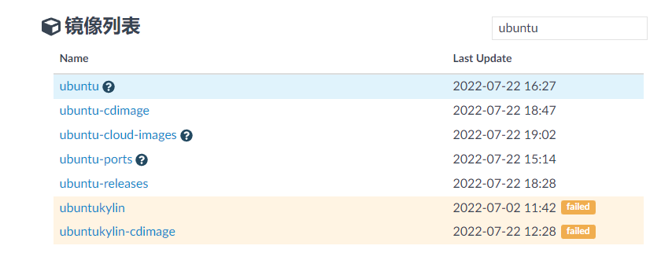
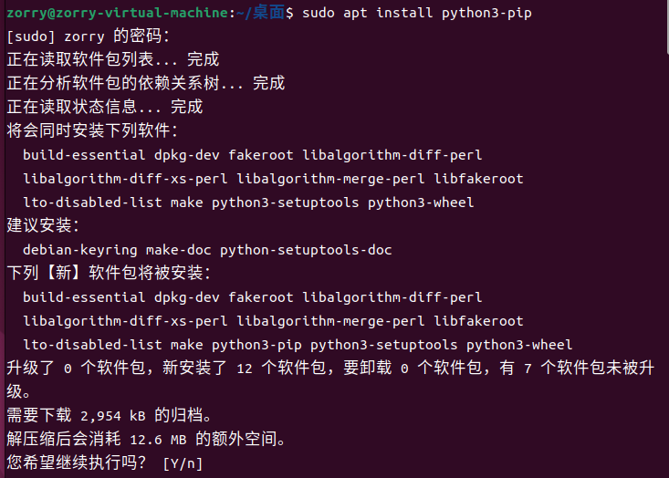
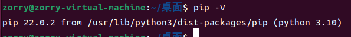
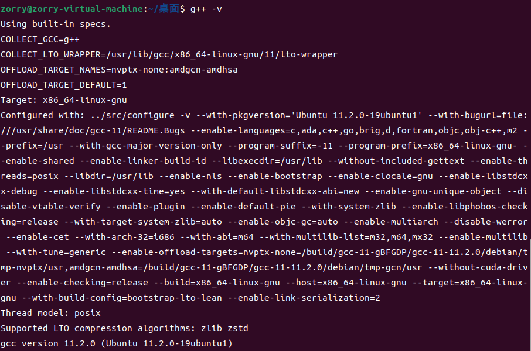

# Linux入坑指南

本指南是笔者摸鱼时所编写的，旨在帮助从未接触或浅尝过Linux的同学快速上手使用Linux。受限于笔者自身水平，指南中可能存在不当阐述、可能存在相关科技野史，敬请理解。


## 第1节 什么是Linux

### 1.1 Linux Kernel

上世纪70年代，美国AT&T公司下属的贝尔实验室开发了一款名为UNIX（Uniplexed Information and Computing Service，非复用信息和计算机服务）的计算机操作系统，并以低廉甚至免费的价格将UNIX授权给学术机构使用。1979年，AT&T将UNIX源代码私有化，学术机构不再能使用UNIX的代码，荷兰阿姆斯特丹自由大学的教授Andrew S. Tanenbaum在不使用AT&T代码的前提下，开发了一款能用兼容UNIX的系统用于教学，取名为MINIX。1991年，一个名为Linus Benedict Torvalds的芬兰大学生在接触MINIX后，不满足其被限制于教学，于是自己编写了一套内核，并将其放在了学校的FTP服务器上，最初Linus把这个内核叫做Freax，但是学校的管理员认为这个名字不好听，于是把他改成了Linux，Linux的传奇从这里开始了。

如今，Linus就职于OSDL（Open Source Development Labs，开源码发展实验室），担任Linux内核的主要维护者。


> 这只企鹅是Linux的标志，选择他的原因据说是Linus曾在动物园被企鹅咬过。

### 1.2 Linux发行版

上面说到，Linus只发布了Linux的内核，而操作系统单单只有内核是不够的，还需要许多配套的软件。例如微软最新的Windows11操作系统，其搭载了Windows NT 10.0内核和微软众多配套的软件。一些组织团体和公司将配套的软件合并起来，与Linux内核一起打包，形成Linux的发行版，这才形成了我们常说的Linux操作系统。目前，有超过300种发行版被积极开发，较为知名的有Debian系的Ubuntu、RHEL系的CentOS以及Arch系Arch Linux。此外我们常用的Android在某种角度也是Linux的发行版，我们可以在手机的设置中查看其搭载的Linux内核版本。

#### 1.2.1 CentOS

CentOS（Community Enterprise Operating System，社区企业操作系统）是RHEL（Red Hat Enterprise Linux）系统的再发行版。CentOS与RHEL出自同样的源代码，其中，RHEL是Red Hat公司开发的针对商业市场的Linux发行版，使用RHEL的企业需要向Red Hat支付响应的费用，而Red Hat也会向其提供相应的技术支持；CentOS则免费向所有用户开放，但客户无法获得官方的技术支持。由于CentOS的开放，其获得了国内众多互联网企业的支持，大量的服务器均采用CentOS，令人惋惜的是，CentOS开发团队于2020年12月8日宣布，传统的CentOS 8将仅维护至2021年底，也就是说，如今的CentOS已经停止更新。

#### 1.2.2 Arch Linux

Arch Linux是一个加拿大吉他手开发的Linux发行版。Arch Linux 项目注力于简洁主义，其贡献在于对发行版的组件提供具有良好注释的配置文件，而非带有图形界面的配置工具。与其他发行版每隔一段时间就发布一个大版本更新不同，Arch Linux致力于通过滚动发布来提供大多数软件的最新稳定版本，只要保证合理使用，就可以很好的避免系统的损坏。目前Arch Linux仍然保持更新。

#### 1.2.3 Ubuntu

与前两个发行版相比，Ubuntu的知名度更高，其常年位于Linux发行版装机排行榜前列，由英国Canonical公司发布并提供有偿商业支持。Ubuntu专注于桌面领域，为用户提供了众多便利，受到广大开发者青睐。Ubuntu每两年发布一个LTS（Long-Term Support）版本，并提供3年的更新支持。

#### 1.2.4 国产操作系统

目前国内大力扶持的国产操作系统UOS（Unite Operating System，统一操作系统）是基于Debian开发的Linux发行版，其针对国内开发者与普通消费者对系统进行了大刀阔斧的改动，使得系统更符合人们日常使用需要。

UOS的前身Deepin OS是深度科技（就是最初做盗版Windows XP的那个深度）开发的Linux发行版，其先后基于Ubuntu和Debian进行开发，日前，深度已经宣布后续的Deepin将基于上游Linux直接开发，届时Deepin的国产化程度将进一步上升。

华为公司捐赠给开放原子开源基金会的openEuler（欧拉操作系统）也是国产操作系统的另一只力量，其主要针对服务器领域，针对各类国产平台进行了专门的优化，其希望在后CentOS时代占有更多市场份额。

### 1.3 小结

本节介绍了Linux内核的发展历史以及各种发行版，帮助大家了解Linux的历史。后续，本文将基于Ubuntu介绍Linux的使用方法。


## 第2节 Ubuntu的安装

ISO下载

U盘

BIOS启动项设置

硬盘分区

虚拟机

启用SSH/VNC


## 第3节 环境搭建

### 3.1 包管理工具

我们在使用Windows系统安装我们需要的软件时，通常需要打开浏览器，打开百度，搜索我们需要的软件名，找到它的安装包（exe或msi格式的可执行文件），下载后双击运行安装~~（然后出现2345全家桶）~~。Ubuntu为我们提供了便利的包管理工具apt（Advanced Packaging Tool），我们日常所需的绝大部分软件都可以由APT直接下载安装，省去了寻找安装包的过程，大大提高了系统的维护效率。

APT的服务器位于国外，由于众所周知的原因，我们访问国外服务器的速度十分缓慢，有时甚至无法访问，因此，我们需要配置apt的国内镜像源来加速APT的下载。

常用的国内的镜像源有：清华源、中科大源、网易源、阿里源等，本文以清华源为例，配置apt的镜像源。

使用火狐浏览器打开[清华大学开源软件镜像站](https://mirrors.tuna.tsinghua.edu.cn/)，搜索ubuntu，点击搜索到的第一项ubuntu后的问号进入帮助页面。



选择Ubuntu的版本，本文依旧以最新的22.04LTS为例。根据帮助文档可以知道，Ubuntu 的软件源配置文件是 `/etc/apt/sources.list`，我们先对系统文件进行备份，然后将其替换成清华源即可。

使用`Ctrl + ALT + T`调出终端，输入`cp /etc/apt/sources.list /etc/apt/sources.list.bak`，使用`cp`命令将`/etc/apt/sources.list`文件复制到`/etc/apt/sources.list.bak`。

不出意外的话，意外出现了。系统提示“权限不够，无法创建文件”，这是为什么呢？由于我们复制的是系统文件，普通用户组的权限不够，无法完成任务，因此，我们需要使用`sudo`命令，启用管理员权限来完成复制操作。再次输入`sudo cp /etc/apt/sources.list /etc/apt/sources.list.bak`（此处可以点击键盘上键快速转到上一条指令），按下回车，输入账户密码，即可完成复制。注意，输入密码时，终端上不会显示任何字符，只要正确输入密码后按下回车即可。

复制后，我们开始对原始文件进行编辑。对于桌面端，我们可以使用gedit对文档进行编辑。输入命令`sudo gedit /etc/apt/sources.list  `，使用Ubuntu自带的文本编辑器gedit打开文件，我们将其存在的所有字符删除，然后粘贴帮助页面提供的内容，保存后即可退出。对于服务器端，没有图形运行环境，我们可以使用nano对文档进行编辑。输入命令`sudo nano /etc/apt/sources.list  `，使用命令行软件nano编辑文件，将其存在的所有字符删除后，右键鼠标粘贴帮助页面提供的内容，之后使用`Ctrl + O`写入文件，使用`Ctrl + X`退出编辑。

完成镜像源配置后，我们就可以使用apt更新系统组件了。输入命令`sudo apt update`，apt会更新自身的索引，在经过短暂的等待后，apt会列出可用的更新，输入`sudo apt upgrade`即可更新全部软件。

### 3.2 Python开发环境

#### 3.2.1 Python

在本文所使用的Ubuntu22.04中，系统已默认安装了Python3.10版本，无需额外安装Python。

#### 3.2.2 pip

系统并未安装Python的包管理工具pip，我们需要进行额外的安装。

使用`Ctrl + ALT + T`调出终端，输入`sudo apt install python3-pip`，在apt询问是否安装时，输入Y后回车或直接回车同意继续安装。



稍作等待后即可成果安装。输入`pip -V`验证配置是否成果，配置无误时会返回pip和python的版本号。



与apt相同的，pip的服务器也位于国外，访问速度较慢，我们需要对pip配置镜像源。常用的源有清华源、豆瓣源、阿里源等，本文以清华源为例进行配置。

输入命令`mkdir ~/.pip`，在根目录下创建一个名为`.pip`的文件夹，输入命令`nano ~/.pip/pip.conf`创建配置文件，输入以下内容：

```
[global]
timeout = 6000
index-url = https://pypi.tuna.tsinghua.edu.cn/simple/
```

之后使用`Ctrl + O`写入文件，使用`Ctrl + X`退出编辑，即可完成对pip的镜像源配置。

#### 3.2.3 Anaconda

Anaconda是可以便捷获取包且对包能够进行管理，同时对环境可以统一管理的Python发行版本。Anaconda包含了conda、Python在内的超过180个科学包及其依赖项。我们在开发不同项目时使用的包版本可能不尽相同，因此使用Anaconda对生成虚拟环境，不同环境间存在隔离，便于开发。

终端输入命令`sudo apt install libgl1-mesa-glx libegl1-mesa libxrandr2 libxrandr2 libxss1 libxcursor1 libxcomposite1 libasound2 libxi6 libxtst6`安装Anaconda运行所需要的环境

浏览器打开[Anaconda](https://www.anaconda.com/products/distribution#linux)的下载页面，点击右侧的绿色下载按钮，可以得到sh格式的安装文件

进入下载文件夹，打开终端，输入命令`bash ./Anaconda3-2022.05-Linux-x86_64.sh`即可开始安装。

终端开始打印安装相关事宜，一路回车后输入`yes`接收安装许可，继续回车将Anaconda安装至默认目录（官方推荐），等待片刻后即可完成安装。

安装完成后输入`sudo nano ~/.bashrc`，将光标移动至文件最下方，加入`export PATH="/home/USERNAME/anaconda3/bin:$PATH"`（USERNAME用自己的用户名代替），使用`Ctrl + O`写入文件，使用`Ctrl + X`退出编辑，输入`source ~/.bashrc`更新环境变量。输入`anaconda-navigator`即可打开图形化管理页面。


Anaconda换清华源

### 3.3 C/C++开发环境

在Windows平台，我们常使用微软的Visual Studio进行C/C++开发。在Ubuntu上，有许多种开发C/C++的办法，此处介绍GCC的开发环境。

使用`Ctrl + ALT + T`调出终端，分别输入`sudo apt install gcc`和`sudo apt install g++`，即可完成GCC套件的安装。输入`gcc -v`和`g++ -v`即可验证配置是否正确，在配置正确时，终端会打印出gcc的版本信息。



接下来我们尝试使用gcc编译c文件。

输入命令`touch main.c`，在根目录下创建一个名为`main.c`的文件，这是一个标准的C语言文件。接着输入`nano main.c`使用nano打开这个文件，输入经典的HelloWorld代码：

```c
#include <stdio.h>

int main(void){
	printf("Hello World!\n");
	return 0;
}
```

输入完成后使用`Ctrl + O`写入文件，使用`Ctrl + X`退出编辑。

输入命令`gcc main.c`对该文件进去参数缺省的编译，编译结束后输入`ls`命令，`ls`命令可以展示所在目录下的所有文件，我们可以看到目录下存在一个名为`a.out`的文件，这就是参数缺省编译出的文件。

在终端输入`a.out`尝试运行我们编译的程序，不出意外的话，意外又出现了，系统又提示我们“未找到命令”，这是因为Linux在执行二进制文件时的搜索目录默认不包括当前目录，因此Linux找不到我们要执行的`a.out`文件，我们需要加上他所在的目录，才能使Linux正确地找到并执行这个文件。

使用相对路径`./`，输入`./a.out`，就可以看到“Hello World!”被打印在终端上。

### 3.4 代码编辑器

VSCode（Visual Studio Code）是微软基于Electron开发的跨平台编辑器，默认支持非常多的编程语言，包括 JavaScript、TypeScript、CSS 和 HTML；也可以通过下载扩展支持 Python、C/C++、Java 和 Go 在内的其他语言。在 2019 年的 Stack Overflow 组织的开发者调查中，Visual Studio Code 被认为是最受开发者欢迎的开发环境。下面介绍VSCode的安装与配置。

使用浏览器打开[Visual Studio Code](https://code.visualstudio.com/)官网，点击左侧蓝色的下载按钮，即可得到deb格式的安装包，打开后就可以使用软件安装管理器安装VSCode，安装结束后可以在软件菜单中找到VSCode，单击打开。

VSCode默认使用英文界面，我们先对其进行汉化。点击左侧工具栏最下方的按钮，在弹出的界面中输入chinese，在搜索到的拓展中选择`Chinese(Simplified)(简体中文)`一项，单击`install`进行安装，并根据软件提示重启软件，重启过后的软件便完成汉化。


我们继续安装常用的拓展项，搜索`Material`选择`Material Icon Theme`安装图标主题；搜索`C`选择`C/C++`和`C/C++ Extension Pack`安装C/C++增强支持；搜索`python`选择`Python`和`Python Extension Pack`安装Python增强支持；搜索Markdown选择`Markdown All in One`安装Markdown支持。

### 3.5 集成开发环境

安装jetbrains全家桶

注册学生账户

### 3.6 深度学习环境

NVIDIA驱动

CUDA驱动

CUDNN驱动

安装pytorch
