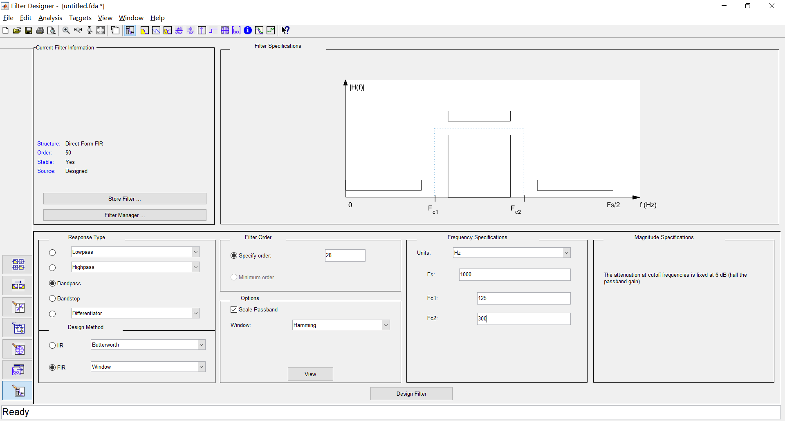
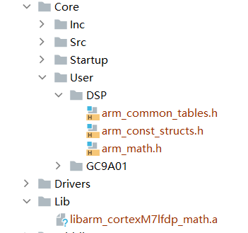
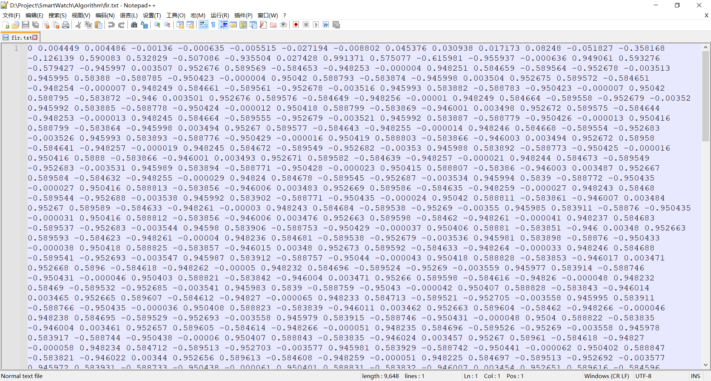
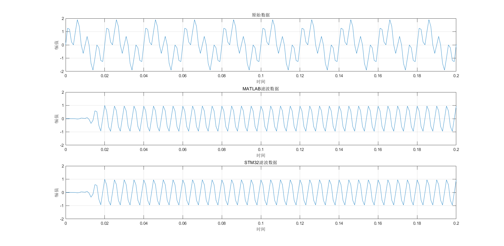

# STM32实现DSP功能

开发环境：Windows10 21H2 + CLion + STM32CubeMX

开发平台：ART-Pi(STM32H750XBH6)

## 前言

前段时间入手了RT-THread家的ART-Pi当开发板用，想要做一个PPG采集装置，经过研究发现需要实现一个FIR带通滤波器，正好H7集成了硬件DSP单元，于是折腾了一下。

## 实验内容

### 1.滤波器设计

使用MATLAB R2018b，命令行输入`filterDesigner`打开滤波器设计工具



选择**使用窗函数的FIR带通滤波器**，阶数设置为**28**， 选用**汉明窗**，设置采样频率为**1000Hz**，通带截止频率为**125Hz与300Hz**

点击Design Filter后点击Target -> Generate C Header，选择Single-precision float，点击Generate

### 2.配置STM32开发环境

访问https://github.com/arm-software/CMSIS_5下载CMSIS，或使用STM32CubeMX生成全部文件获得CMSIS软件包

在项目根目录下创建Lib文件夹，复制libarm_cortexM7lfdp_math.a至文件夹中

创建Core/User/DSP文件夹，复制arm_common_tables.h、arm_const_structs.h、arm_math.h三个文件至目录中



在CMakeLists中，添加：

```cmake
include_directories(Core/User/DSP)
link_directories(Lib)
link_libraries(libarm_cortexM7lfdp_math.a)
```

在用户代码中添加`#include "arm_math.h"`头文件

### 3.使用STM32生成信号并滤波

定义如下常量：

```c
#define TEST_LENGTH_SAMPLES 1024 //采样点数
#define BLOCK_SIZE 1 //每次处理点数
#define NUM_TAPS 29 //滤波器系数个数
```

声明变量：

```c
uint32_t blockSize = BLOCK_SIZE;
uint32_t numBlocks = TEST_LENGTH_SAMPLES / BLOCK_SIZE;

static float32_t testInput_f32[TEST_LENGTH_SAMPLES];
static float32_t testOutput[TEST_LENGTH_SAMPLES];
static float32_t firStateF32[BLOCK_SIZE + NUM_TAPS - 1];
```

将MATLAB生成的滤波器系数导入：

```c
const float32_t firCoeffs32BP[NUM_TAPS] = {
        0.003531039227f,    0.0002660876198f,   -0.001947779674f,  0.001266813371f,  -0.008019094355f,
        -0.01986379735f,    0.01018396299f,     0.03163734451f,    0.00165955862f,   0.03312643617f,
        0.0622616075f,      -0.1229852438f,     -0.2399847955f,    0.07637182623f,   0.3482480049f,
        0.07637182623f,     -0.2399847955f,     -0.1229852438f,    0.0622616075f,    0.03312643617f,
        0.00165955862f,     0.03163734451f,     0.01018396299f,    -0.01986379735f,  -0.008019094355f,
        0.001266813371f,   -0.001947779674f,    0.0002660876198f,  0.003531039227f
};
```

创建计算函数：

```c
void arm_fir_f32_bp(void) {
    uint32_t i;
    arm_fir_instance_f32 S;
    float32_t *inputF32, *outputF32;

    inputF32 = &testInput_f32[0];
    outputF32 = &testOutput[0];

    arm_fir_init_f32(&S, NUM_TAPS, (float32_t *) &firCoeffs32BP[0], &firStateF32[0], blockSize);

    for (i = 0; i < numBlocks; i++) {
        arm_fir_f32(&S, inputF32 + (i * blockSize), outputF32 + (i * blockSize), blockSize);
    }

    for (i = 0; i < TEST_LENGTH_SAMPLES; i++) {
        printf("%f, %f\r\n", testOutput[i], inputF32[i]);
    }
}
```

生成待滤波信号：

```c
uint16_t i;
for (i = 0; i < TEST_LENGTH_SAMPLES; i++) {
    /* 50Hz正弦波+200Hz正弦波，采样率1KHz */
    testInput_f32[i] = arm_sin_f32(2 * 3.1415926f * 50 * i / 1000) + arm_sin_f32(2 * 3.1415926f * 200 * i / 1000);
}
```

运行`arm_fir_f32_bp()`即可在串口得到滤波前后数据，将串口助手打印出的数据复制到fir.txt中



### 4.验证滤波效果

使用MATLAB进行验证，代码如下：

```matlab
fs = 1000;
N = 1024;
n = 0:N-1;
t = n/fs;
f = n*fs/N;

x = sin(2*pi*50*t)+sin(2*pi*200*t);
b = fir1(28, [125*2/1000 300*2/1000]);
y = filter(b,1,x);

subplot(3,1,1);
plot(t,x);
axis([0,0.2,-2,2]);
title('原始数据');
xlabel('时间');
ylabel('幅值');
grid on;

subplot(3,1,2);
plot(t,y);
axis([0,0.2,-2,2]);
title('MATLAB滤波数据');
xlabel('时间');
ylabel('幅值');
grid on;

subplot(3,1,3);
d = importdata('fir.txt');
plot(t,d);
axis([0,0.2,-2,2]);
title('STM32滤波数据');
xlabel('时间');
ylabel('幅值');
grid on;
```

验证结果如下：



可以看出，滤波数据与MATLAB近似，效果明显。


**关联文档：**
上一篇：[[STM32开发·[1.2]笔记]]
下一篇：无