# Zynq的HelloWorld

开发环境：Windows11 22H2 + Vivado 2021.2 + Vitis IDE 2021.2

硬件资源：SDRPi（Zynq7020 + AD9361）

修改时间：2023年3月26日17:10:00

## 安装开发环境

自2019版本以后，Vivado不再自带SDK开发环境，需要使用Vitis进行Zynq PS端的开发。

如已经安装了Vivado，且没有安装Vitis IDE，需要卸载Vivado后重新安装，在打开安装软件后，选择默认的Vitis进行安装，Vitis套件会自动安装Vivado软件。

## 搭建硬件环境

### 新建工程

打开Vivado软件，新建工程，在器件选项中选择**xc7z020clg400-2**完成工程创建。

### 搭建Block Design

#### 新建PS端

进入Vivado主界面后，在左侧导航栏中选择`Create Block Design`，输入`system`作为设计名称。

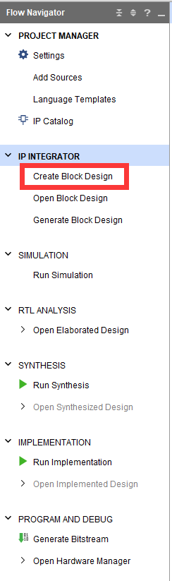

在右侧的`Diagram`中，点击加号，搜索`ZYNQ7 Processing System`添加此模块。


#### 编辑外设设置

双击模块进入编辑界面。

##### 串口设置

在`Peripheral I/O Pins`中，将Bank0设置为**LVCMOS 3.3V**，Bank1设置为**LVCMOS 1.8V**，激活48/49号I/O对应的USART1接口。

在`PS-PL Configuration -> General`中，可以设置UART1的波特率。

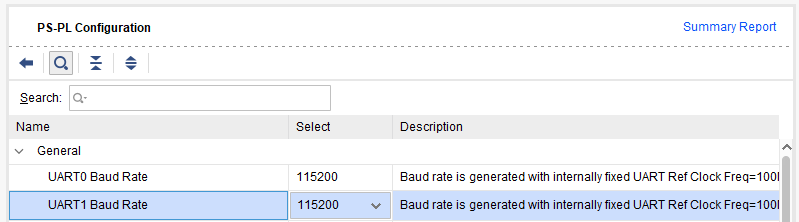

##### GPIO设置

在`Peripheral I/O Pins`中，激活**GPIO MIO组**。本次使用的GPIO为MIO15，对应板子上LED灯，GPIO输出高时LED点亮。


##### DDR设置

在`DDR Controller Configuration -> DDR Controller Configuration`中，设置DDR3内存型号为**MT41K256M16RE-125**，其余设置保持默认。

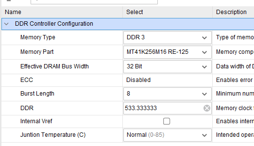

##### 时钟设置

在`Clock Configuration`中，设置外置晶振频率为33.333333MHz。

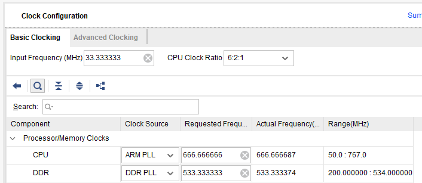

##### 移除PL端

在`Clock Configuration -> PL Fabric Clocks`中，取消`FCLK_CLK0`选项。

在`PS-PL Configuration -> General -> Enable Clock Resets`中，取消`FCLK_RESET0_N`选项。

在`PS-PL Configuration -> AXI Non Secure Enablement -> GP Master AXI Interface`中，取消`M AXI GP0 interface`选项。

### 导出硬件

点击对钩进行验证，验证无误后进行下一步。


在`Sources -> Design Sources -> system.bd`上右键，选择`Generate Output Products`，在`Synthesis Options`中选择**Global**，点击Generate生成xdc文件。

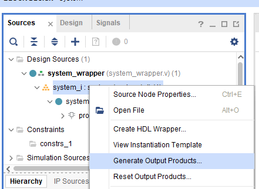

在`Sources -> Design Sources -> system.bd`上右键，选择`Create HDL Wrapper`，选择`Let Vivado manage wrapper and auto update`，点击OK。

在菜单栏选择`File -> Export -> Export hardware`，点击OK。

## Vitis开发

在菜单栏选择`Tools -> Launch Vitis IDE`打开Vitis IDE。

### 新建工程

在菜单栏选择`File -> New -> Platform Project `，输入项目名，在`Hardware Specification`中点击Browser，选择Vivado导出的xsa文件，其余默认，点击`Finish`。

在菜单栏选择`File -> New -> Application Project`，选择刚刚新建的Platform，数据项目名，选择`Empty Application(C)`，其余默认，点击`Finish`。

### 初识Vitis

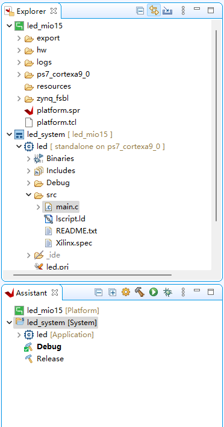

#### mss文件与spr文件

Vitis的左侧栏中，对应Platform Project的树中，双击spr文件，选择`ps7_contexa9_0 -> standalone on ps7_contexa9_0 -> Board Support Package `，此界面对应早期SDK开发中的mss文件。

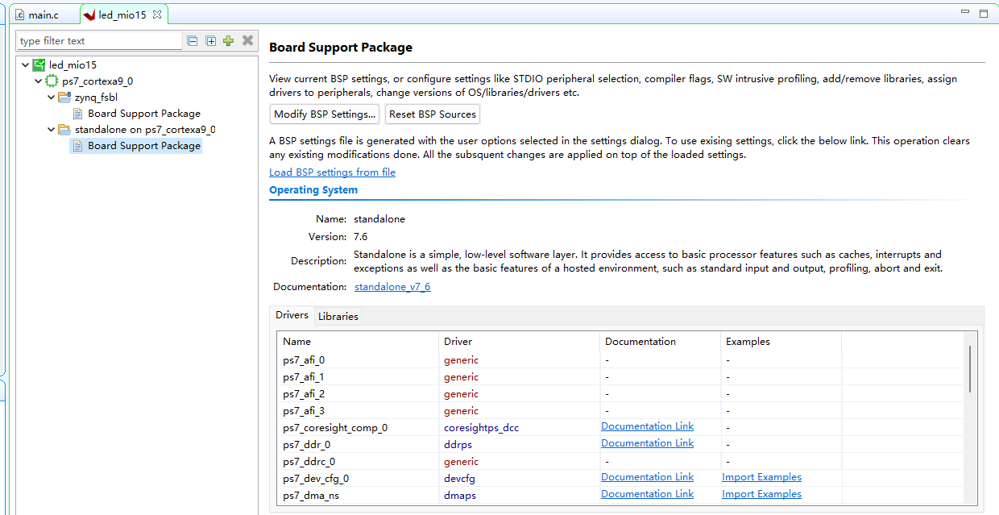

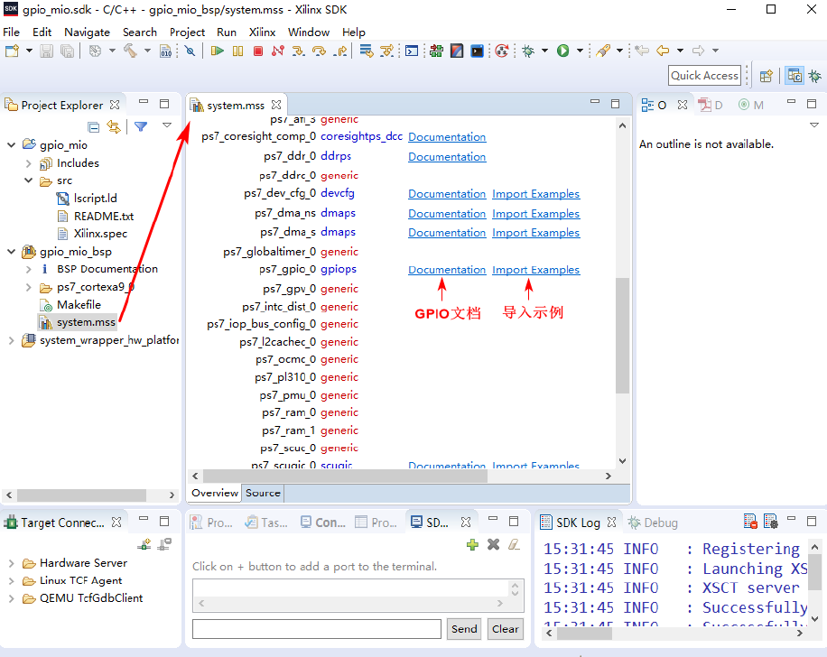

#### 修改编辑器字体

在编辑器区域右键选择`Preferences`，进入`General -> Appearance -> Colors and Fonts -> Basic -> Text Font`，即可修改字体。

#### 自动补全

在输入代码时，按下`Alt + /`即可激活自动补全。

#### 串口查看器

在菜单`Window -> Show View... `中，搜索`Terminal`，选择`Terminal -> Terminal`。

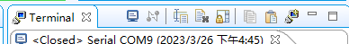

在`Terminal`中，选择第一项`Open a Terminal`，在弹出的菜单中选择`Serial Terminal`，在下方选择串口参数，点击OK。

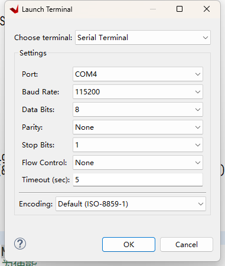

### 编辑代码

左侧文件树中，在项目下src文件夹右键选择`New -> File`，新建`main.c`文件。输入以下代码：

```C
#include "xparameters.h"
#include "xstatus.h"
#include "xil_printf.h"
#include "xgpiops.h"
#include "sleep.h"

#define GPIO_DEVICE_ID XPAR_XGPIOPS_0_DEVICE_ID
#define MIO15 15

XGpioPs Gpio;

int main(){
	int Status;
	XGpioPs_Config *ConfigPtr;

	print(">>MIO Test\r\n");
	ConfigPtr = XGpioPs_LookupConfig(GPIO_DEVICE_ID);
	Status = XGpioPs_CfgInitialize(&Gpio, ConfigPtr, ConfigPtr->BaseAddr);

	if(Status != XST_SUCCESS){
		return XST_FAILURE;
	}
	// 设置指定引脚的方向，0为输入，1为输出
	XGpioPs_SetDirectionPin(&Gpio, MIO15, 1);
	// 使能指定引脚输出，0为禁止，1为使能
	XGpioPs_SetOutputEnablePin(&Gpio, MIO15, 1);

	while(1){
		XGpioPs_WritePin(&Gpio, MIO15, 0x0);
		print(">>MIO SET 0\r\n");
		sleep(1);
		XGpioPs_WritePin(&Gpio, MIO15, 0x1);
		print(">>MIO SET 1\r\n");
		sleep(1);
	}

	return XST_SUCCESS;
}

```

### 编译、运行项目

在左侧Assistant中，选择System项目，点击编译按键。编译结束后点击Run按键。

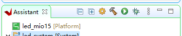

## 观察实验

插入JTAG线与串口线后运行项目，可以观察到MIO15对应的LED灯闪烁，串口打印文字正确。