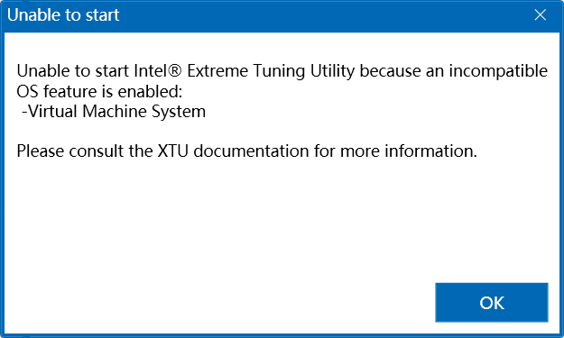
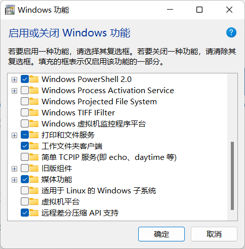

## 前言

前两天闲得○疼装了WSA，想试试电脑上刷抖音的感觉，然后装上觉得没意思就卸载了，之后笔记本的风扇转速就降不下来了，跟惠普的客服掰扯了四十分钟以后被建议重置系统。后来折腾了两三天发现了问题，遂解决。

## 环境

机型：暗影精灵8 i7-12700H RTX3050Ti

系统：Windows11+HP Gaming Hub

## 原因

WSA启动了Windows的虚拟机支持，开启了Hyper-V功能，而最新版的XTU是无法在Hyper-V启动的时候正常工作的，报错如下：

XTU提示因为启用了Virtual Machine System，所以无法正常启动。



惠普的Gaming Hub也是调用了XTU的API对风扇进行调整，XTU不能工作，惠普的面板也就寄了，直接导致手动拉曲线把风扇拉满也只会调整为默认的2400转。

## 解决方法

右键开始菜单打开管理员权限的控制台，使用powershell运行以下命令：

```powershell
bcdedit /set hypervisorlaunchtype off
```

随后手动重启系统。

进入系统后，打开控制面板-程序和功能-启用或关闭Windows功能，取消勾选**虚拟机平台**一项，随后再次重启系统。



再次进入系统后，XTU可以正常运行，打开HP Gaming Hub，可以进行风扇调速，问题解决。